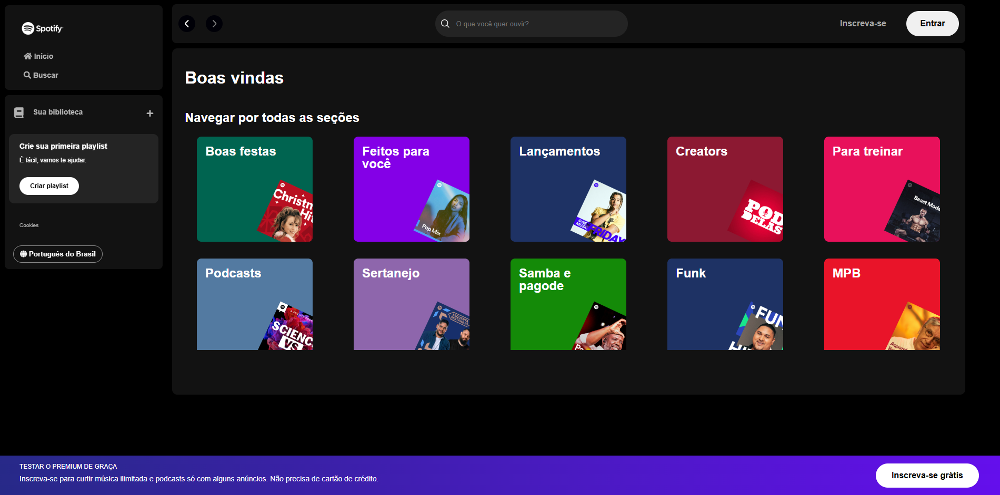

# Imersão Front-End Alura 🎵🟢

Esse projeto foi desenvolvido durante a **Imersão Front-End da Alura**, onde criamos uma réplica da interface do Spotify.
O objetivo foi aplicar conceitos essenciais de HTML, CSS e JavaScript para construir uma página moderna.

## 📃 Sobre o projeto

Durante cinco aulas intensivas, foi abordado diversas técnicas de desenvolvimento front-end, desde organização de pastas até a criação de componentes
visuais com CSS. O resulto é uma interface visualmente rica e interativa, inspirada no Spotify.

---

## 🪜 Estrutura de Pastas  

- `api-artists`: contém um arquivo `artists.json` com dados sobre artistas.  
- `src`: pasta principal que organiza os recursos do projeto.  
  - `assets/icons`: ícones utilizados na interface.  
  - `assets/playlist`: imagens das playlists.  
  - `styles`: arquivos CSS divididos por responsabilidade:  
    - `main-content.css`: estilização da área principal.  
    - `media-queries.css`: responsividade.  
    - `reset.css`: reset de estilos padrão.  
    - `sidebar-footer.css`: rstilização da sidebar e rodapé.  
    - `vars.css`: variáveis CSS para manter uma paleta de cores e design consistente.  
- `index.html`: estrutura principal da página.  
- `script.js`: funcionalidades interativas com JavaScript.  

---

## 🧑‍💻 Tecnologias Utilizadas

- **HTML5:** estruturação do conteúdo.
- **CSS3:** estilização e responsividade.
- **JavaScript:** interatividade da página.
